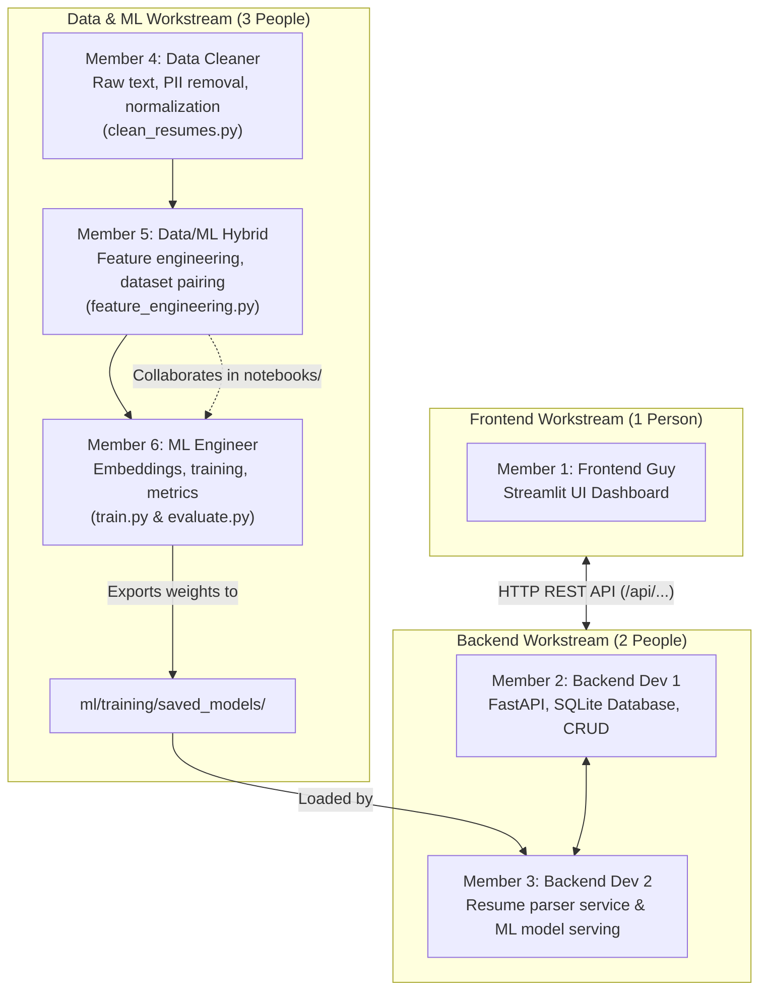

# 🚀 HireLens — Team Development Guide (6-Member Team)

Welcome team! This document is our single source of truth for the hackathon. It explains **who works where**, **how to run each component**, and **how our 6 members divide responsibilities**.

---

## 👥 The 6-Member Roster & Workspaces

```text
HireLens/
├── frontend/             # Member 1: Frontend Developer
├── backend/              # Member 2 & Member 3: Backend Engineers
└── ml/
    ├── data_cleaning/    # Member 4: Data Cleaner & Member 5: Data/ML Hybrid
    └── training/         # Member 5: Data/ML Hybrid & Member 6: ML Engineer
```

| Member | Role | Workspace | Key Deliverable |
|---|---|---|---|
| **Member 1** | **Frontend Engineer** | `frontend/` | Streamlit UI, visual dashboards, connecting API calls |
| **Member 2** | **Backend Dev 1** | `backend/` | Database (SQLite), candidate persistence, CRUD endpoints |
| **Member 3** | **Backend Dev 2** | `backend/` | Resume parsing service & ML inference serving engine |
| **Member 4** | **Data Cleaning Specialist** | `ml/data_cleaning/` | Data collection, text cleaning, PII removal, normalization |
| **Member 5** | **Data & ML Hybrid** | `ml/data_cleaning/` & `ml/training/` | Feature engineering, skill vocabulary, train/test dataset pairing |
| **Member 6** | **ML Model Engineer** | `ml/training/` | Model architecture (Sentence-BERT / TF-IDF), training, export to `saved_models/` |

---

## 🔄 The 6-Person Hand-Off Pipeline



---

## 📌 Detailed Role Assignments

---

### 🎨 Member 1: Frontend Engineer
* **Workspace:** [`frontend/`](./frontend)
* **Main Files:** `frontend/app.py`, `frontend/requirements.txt`
* **How to Run:**
  ```bash
  pip install -r frontend/requirements.txt
  streamlit run frontend/app.py
  ```
* **Responsibilities:**
  1. Continue refining UI/UX, styling, candidate cards, and score filters.
  2. The UI currently uses temporary mock files (`job_analyzer.py`, `resume_parser.py`, `scoring.py`).
  3. Once Backend provides API routes (`http://localhost:8000/api/...`), replace the mock function calls with `requests.post()`.
  4. Render real ML candidate rankings, confidence scores, and skill gap highlights.

---

### ⚙️ Member 2: Backend Dev 1 (Platform, Database & API)
* **Workspace:** [`backend/`](./backend)
* **Main Files:**
  * `backend/app/main.py` — FastAPI entrypoint with CORS
  * `backend/app/database.py` — SQLite connection & SQLAlchemy models *(to build)*
  * `backend/app/api/routes_resumes.py` — Resume upload endpoint
  * `backend/app/models/schemas.py` — Pydantic request/response schemas
* **How to Run:**
  ```bash
  pip install -r backend/requirements.txt
  cd backend
  uvicorn app.main:app --reload --port 8000
  ```
  *(Interactive API Docs at: `http://localhost:8000/docs`)*
* **Responsibilities:**
  1. Set up SQLite database with tables for `candidates`, `job_descriptions`, and `match_results`.
  2. Implement candidate persistence so data stays saved across page refreshes.
  3. Build CRUD endpoints (`GET /api/candidates`, `DELETE /api/candidates/{id}`).
  4. Help Frontend connect Streamlit to FastAPI.

---

### 🧠 Member 3: Backend Dev 2 (Parsing & ML Serving Engine)
* **Workspace:** [`backend/app/services/`](./backend/app/services)
* **Main Files:**
  * `backend/app/services/parser_service.py` — Document parsing & section extraction
  * `backend/app/services/ml_service.py` — Model loader & inference scoring logic
  * `backend/app/api/routes_match.py` — Matching route
* **Responsibilities:**
  1. In `parser_service.py`, extract clean text from PDF (`pypdf` / `pdfplumber`), DOCX, and TXT files.
  2. Segment resumes into structured sections (Experience, Education, Skills, Projects).
  3. In `ml_service.py`, load the trained model weights exported by Member 6 into `ml/training/saved_models/`.
  4. In `compute_match()`, run candidate profiles + JD through the ML model and return rankings and score breakdowns.

---

### 🧹 Member 4: Data Cleaning Specialist (Raw Data & Text Cleaning)
* **Workspace:** [`ml/data_cleaning/`](./ml/data_cleaning)
* **Main Files:**
  * `ml/data_cleaning/raw/` — Drop raw CSV/JSON datasets here
  * `ml/data_cleaning/clean_resumes.py` — Cleaning script
* **Responsibilities:**
  1. Download target resume/job datasets (e.g. from Kaggle) and place in `raw/`.
  2. Strip personal data (emails, phone numbers, URLs) for privacy compliance.
  3. Remove HTML tags, formatting artifacts, non-ASCII characters, and boilerplate text.
  4. Pass the cleaned text dataset to Member 5 for feature engineering.

---

### 🌉 Member 5: Data & ML Hybrid (Features & Training Preparation)
* **Workspace:** [`ml/data_cleaning/`](./ml/data_cleaning) and [`ml/training/`](./ml/training)
* **Main Files:**
  * `ml/data_cleaning/feature_engineering.py` — Feature extraction & pairing
  * `ml/data_cleaning/processed/` — Save training-ready data here
  * `ml/training/notebooks/` — EDA & exploratory experiments
* **Responsibilities:**
  1. **Bridge Data and Modeling:** Take Member 4's cleaned text and turn it into ML-ready inputs.
  2. Create skill extraction vocabularies, tokenized representations, and section tags.
  3. Build Resume ↔ Job Description pairs (e.g. matching pairs vs non-matching pairs) with similarity ground truth.
  4. Generate train/validation/test splits into `ml/data_cleaning/processed/`.
  5. Work alongside Member 6 on prototyping and testing model performance in `notebooks/`.

---

### 🤖 Member 6: ML Model Engineer (Architecture, Training & Evaluation)
* **Workspace:** [`ml/training/`](./ml/training)
* **Main Files:**
  * `ml/training/train.py` — Reproducible model training script
  * `ml/training/evaluate.py` — Metrics calculation script
  * `ml/training/saved_models/` — **CRITICAL: Export your model weights here**
* **How to Run:**
  ```bash
  pip install -r ml/training/requirements.txt
  python ml/training/train.py
  ```
* **Responsibilities:**
  1. Pick and train the matching model using the prepared data from Member 5:
     * **Option A (Bi-Encoder / Semantic Embeddings):** Use `sentence-transformers/all-MiniLM-L6-v2` to embed resumes and JDs into vector space and compute Cosine Similarity.
     * **Option B (Supervised NLP):** TF-IDF Vectorizer + Cosine Similarity + Classifier (Logistic Regression / XGBoost).
  2. Evaluate accuracy, ranking precision, and score distributions in `evaluate.py`.
  3. Export the trained model weights/vectorizer into `ml/training/saved_models/` (e.g. `model.pkl` or transformer model directory).
  4. Hand off the artifact to Member 3 for serving in `ml_service.py`.

---

## 🤝 Git Best Practices for Our Team

To avoid merge conflicts during the hackathon:
1. **Stick to your assigned folder:**
   - Member 1 ➡️ `frontend/`
   - Member 2 & 3 ➡️ `backend/`
   - Member 4 & 5 ➡️ `ml/data_cleaning/`
   - Member 5 & 6 ➡️ `ml/training/`
2. **Pull before you push:**
   ```bash
   git pull origin main
   ```
3. **Prefix your commit messages:**
   ```bash
   git commit -m "[frontend] design candidate card view"
   git commit -m "[backend-db] add candidate table in sqlite"
   git commit -m "[backend-parser] add pdfplumber text extractor"
   git commit -m "[data-clean] strip pii and clean special characters"
   git commit -m "[feature-eng] create resume-job matching pairs"
   git commit -m "[ml-model] train sentence-transformer embeddings"
   ```
